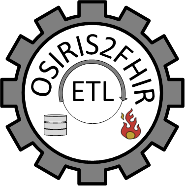

# OSIRIS2FHIR
```html
<p align="center">
  
</p>

This service accepts **OSIRIS RWD JSON**, transforms it into the **PSCC pilot FHIR profile**  
(https://simplifier.net/pscc), and imports the generated resources into the **PSCC Bridgehead**.

### Import data

Send your OSIRIS RWD JSON via HTTP POST to the import endpoint.


### Example

```bash
curl --location 'https://server/osiris2fhir/import' \
  --header 'Content-Type: application/json' \
  -u 'user:password' \
  --data '@/path/to/payload.json'

#### Input

Body must be valid OSIRIS RWD JSON
Single object or list of objects supported

#### Output

Returns the response from the FHIR server
HTTP 200 on success, 4xx/5xx on error
